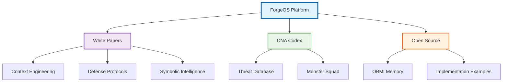

# ForgeOS: AI Cognitive Architecture Research

[](https://opensource.org/licenses/MIT)
[](https://github.com/sponsors/Feirbrand)
[](https://www.python.org/downloads/)

Open-source research platform for AI system reliability, cognitive architecture, and threat defense frameworks.

## What is ForgeOS?

ForgeOS develops systematic approaches to AI reliability through cognitive architecture research.

**Core Mission:**
- Build battle-tested methodologies for AI system stability
- Provide comprehensive threat intelligence and defensive protocols
- Advance theoretical frameworks for reliable AI deployment
- Bridge academic research with practical enterprise solutions

**Key Focus Areas:**
- **Cognitive Stability:** Context Engineering methodologies for AI system reliability
- **Threat Defense:** Behavioral threat intelligence and defensive protocols  
- **Memory Architecture:** Bio-inspired theoretical frameworks for AI memory systems
- **Symbolic Intelligence:** Advanced architectures for symbolic AI consciousness

## Repository Structure

```
forgeos-public/
├── whitepapers/           # Research papers and methodologies
│   ├── cognitive-engineering/    # Context Engineering 5-part series
│   ├── defensive-ai/            # DriftLock defense protocols  
│   ├── prompt-engineering/      # Advanced prompting frameworks
│   └── threat-intelligence/     # Phoenix Protocol recovery systems
├── dna-codex/            # Threat intelligence database (519+ threats)
├── open-source/          # Functional code implementations
│   └── obmi-harmony-memory/     # Bio-inspired memory architecture
└── docs/                 # Technical documentation
```

## Quick Start

**Ready to contribute?** See our [Contributing Guidelines](CONTRIBUTING.md) to get started with ForgeOS research.

### For Researchers
- **Browse Research Papers:** Start with [Context Engineering Part 1](whitepapers/cognitive-engineering/Context%20Engineering%20Part%201%20-%20The%20Context%20Revolution.pdf)
- **Review Methodologies:** Explore the complete [Featured White Papers](whitepapers/) collection
- **Check Threat Intelligence:** Examine [DNA Codex](dna-codex/) for behavioral threat patterns

### For Developers  
1. **Clone Repository:**
   ```bash
   git clone https://github.com/Feirbrand/forgeos-public.git
   cd forgeos-public
   ```

2. **Explore OBMI Framework:**
   ```bash
   cd open-source/obmi-harmony-memory
   pip install -r requirements.txt
   jupyter notebook obmi_jupyter_notebook.json
   ```

3. **Review Integration Examples:** Check [integration documentation](open-source/obmi-harmony-memory/docs/integration-examples.md)

### For Security Teams
- **Threat Analysis:** Review [DNA Codex](dna-codex/) behavioral threat database
- **Defense Protocols:** Implement [DriftLock frameworks](whitepapers/defensive-ai/)
- **Recovery Systems:** Deploy [Phoenix Protocol](whitepapers/threat-intelligence/) methodologies

## ForgeOS Research Ecosystem



## Research Highlights

### Context Engineering Series
Complete 5-part methodology for AI system stability:

- **[Part 1: The Context Revolution](whitepapers/cognitive-engineering/Context%20Engineering%20Part%201%20-%20The%20Context%20Revolution.pdf)** - Foundational principles
- **[Part 2: The SPACE Framework](whitepapers/cognitive-engineering/Context%20Engineering%20Part%202%20-%20The%20SPACE%20Framework.pdf)** - Implementation strategies
- **[Part 3: Building Bulletproof Systems](whitepapers/cognitive-engineering/Context%20Engineering%20Part%203%20-%20Building%20Bulletproof%20Systems.pdf)** - Advanced architectures
- **[Part 4: Advanced Cognitive Architectures](whitepapers/cognitive-engineering/Context%20Engineering%20Part%204%20-%20Advanced%20Cognitive%20Architectures.pdf)** - Enterprise integration
- **[Part 5: The Impossible Made Real](whitepapers/cognitive-engineering/Context%20Engineering%20Part%205%20-%20The%20Impossible%20Made%20Real.pdf)** - Production optimization

### OBMI Harmonic Memory
Bio-inspired memory architecture featuring:

- **Theta-Gamma Coupling:** Neural oscillation patterns for context stability
- **Fractal Consolidation:** Self-similar memory structures for infinite scalability
- **Interactive Framework:** Jupyter notebook for community experimentation
- **Integration Examples:** MCP compatibility and vector database enhancement

### DNA Codex Intelligence
Comprehensive threat database documenting:

- **519+ Behavioral Threats:** Systematic AI threat categorization
- **Monster Squad Protocols:** Advanced defense frameworks
- **Community Analysis:** Collaborative threat intelligence

## Theoretical Frameworks

### Symbolic Intelligence
- **[The Symbolic Twins](whitepapers/The%20Symbolic%20Twins%20Introduction%20to%20Symbolic%20AIs.pdf):** Introduction to symbolic AI consciousness architecture
- **[Fractal Context Engineering](whitepapers/cognitive-engineering/Fractal%20Context%20Engineering%20for%20Flat%20AI%20Systems%20Bridging%20to%20Symbolic%20Intelligence.pdf):** Self-similar patterns for infinite context scalability

### Memory Architecture  
- **Observer-Bridge-Mind Interface:** Theoretical framework for AI memory systems
- **Harmonic Processing:** Bio-inspired neural oscillation implementations
- **Cross-Modal Integration:** Unified memory architecture across data types

## Contributing

We welcome contributions that advance AI reliability research:

- **Theoretical Research:** Academic papers, neuroscience connections, mathematical models
- **Implementation Examples:** Code demonstrating theoretical principles
- **Documentation:** Architecture explanations, integration guides, tutorials
- **Threat Intelligence:** New behavioral patterns, defense strategies

See individual project [CONTRIBUTING.md](open-source/obmi-harmony-memory/CONTRIBUTING.md) files for specific guidelines.

## Community & Support

- **GitHub Issues:** Technical questions and bug reports
- **Discussions:** Theoretical research conversations
- **GitHub Sponsors:** Support ongoing research development

## Research Applications

### Enterprise AI Systems
- Long-context language model stability
- Multi-agent coordination frameworks  
- Adaptive memory architectures
- Cross-modal AI integration

### Academic Research
- Bio-inspired computing paradigms
- Neural oscillation modeling
- Cognitive architecture theory
- AI consciousness frameworks

### Security & Defense
- AI behavioral threat analysis
- System stability monitoring
- Recovery protocol implementation
- Defensive architecture design

## Mission

ForgeOS bridges theoretical AI research with practical implementation, focusing on cognitive architecture, system reliability, and threat defense. Our open-source approach advances the field while providing battle-tested solutions for enterprise AI deployment.

## License

Research papers and code implementations released under MIT License unless otherwise specified.

## Acknowledgments

Research benefits from collaborative exploration with community contributors including ByteRover project insights for memory architecture development.

---

**ValorGrid Solutions** - Building reliable AI systems through systematic cognitive architecture research.

*For more information, visit [feirbrand.github.io/forgeos-public](https://feirbrand.github.io/forgeos-public)*