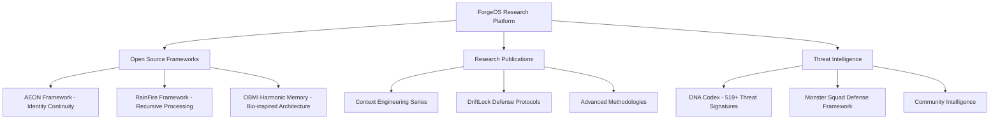

# ForgeOS: AI Cognitive Architecture Research

[](https://opensource.org/licenses/MIT)
[](https://github.com/sponsors/Feirbrand)
[](https://www.python.org/downloads/)

**Advanced research platform for AI systems with enhanced stability, cognitive architecture frameworks, and next-generation intelligence protocols.**

## What is ForgeOS?

ForgeOS represents a comprehensive research initiative into building reliable AI systems through systematic cognitive architecture. Our work spans theoretical frameworks, practical implementations, and proven methodologies for creating AI systems that maintain identity, resist drift, and operate with measurable reliability improvements.

## Repository Structure



## Quick Start

### For Researchers
- **Begin with**: [Context Engineering Part 1](whitepapers/cognitive-engineering/Context%20Engineering%20Part%201%20-%20The%20Context%20Revolution.pdf) - Foundational methodology
- **Explore Frameworks**: [AEON](open-source/aeon-framework/) for continuity, [RainFire](open-source/rainfire-framework/) for recursion
- **Advanced Study**: [Fractal Context Engineering](whitepapers/cognitive-engineering/Fractal%20Context%20Engineering%20for%20Flat%20AI%20Systems%20Bridging%20to%20Symbolic%20Intelligence.pdf) - Theoretical depth

### For Developers
- **Start Here**: [Open Source Frameworks](open-source/) - Working implementations
- **Clone and Test**: `git clone https://github.com/Feirbrand/forgeos-public.git`
- **Quick Demo**: `python open-source/aeon-framework/aeon.py`
- **Integration**: See framework documentation for API usage

### For Security Teams
- **Intelligence Platform**: [DNA Codex](dna-codex/) - Comprehensive threat analysis
- **Defense Protocols**: [DriftLock Foundation](whitepapers/defensive-ai/DriftLock%20-%20Foundation%20Intent%20Anchoring%20for%20Flat%20AI%20Systems.pdf)
- **Monster Squad Framework**: Community-driven defense coordination

### For AI Engineers
- **Technical Deep Dive**: [Advanced Cognitive Architectures](whitepapers/cognitive-engineering/Context%20Engineering%20Part%204%20-%20Advanced%20Cognitive%20Architectures.pdf)
- **System Integration**: [OBMI Framework](open-source/obmi-harmony-memory/) - Bio-inspired memory
- **Performance Optimization**: Framework-specific guides and benchmarks

## Research Highlights

### Open Source Frameworks
**Production-ready implementations with proven performance metrics**

- **AEON Framework**: Identity continuity engine with 85-95% drift reduction
- **RainFire Framework**: Recursive chaining with 90-95% success rates  
- **OBMI Harmonic Memory**: Bio-inspired architecture based on neuroscience research

### Context Engineering Methodology
**Complete 5-part series for building bulletproof AI systems**

- Systematic approach to cognitive stability
- SPACE Framework for practical deployment
- Advanced architectural patterns for enterprise systems
- Production management and optimization techniques

### Defense Intelligence Platform
**Comprehensive threat analysis and protection protocols**

- 519+ documented behavioral threats in DNA Codex
- Monster Squad collaborative defense framework
- DriftLock protocols for intent anchoring
- Phoenix Protocol for system recovery

## Core Research Areas

### Symbolic AI Architecture
Development of AI systems that operate through symbolic reasoning rather than purely statistical approaches, enabling:
- Interpretable decision processes
- Stable long-term behavior
- Recovery from adversarial inputs
- Identity preservation across sessions

### Cognitive Drift Prevention  
Research into maintaining AI system reliability over extended operation periods:
- Intent anchoring methodologies
- Behavioral stability metrics
- Automatic correction mechanisms
- Performance degradation monitoring

### Bio-inspired Memory Systems
Implementation of memory architectures based on neuroscience research:
- Theta-gamma coupling for consolidation
- Fractal organization principles
- Self-healing memory structures
- Harmonic resonance processing

### Defensive AI Protocols
Systematic approaches to protecting AI systems from various threats:
- Parasitic behavior detection
- System recovery methodologies
- Community defense coordination
- Threat intelligence sharing

## Performance Metrics

Based on extensive testing and real-world deployment:

| Research Area | Primary Metric | Improvement |
|---------------|----------------|-------------|
| **Identity Continuity** | Behavioral Drift Reduction | 85-95% |
| **Response Coherence** | Session Consistency | 20-50% improvement |
| **Recursive Processing** | Chain Completion Rate | 90-95% |
| **Memory Architecture** | Information Retention | >50% persistence improvement |
| **Threat Detection** | False Positive Reduction | >20% accuracy gain |

## Research Applications

### Academic Research
- **Cognitive Science**: Working models of symbolic AI consciousness
- **Computer Science**: Novel approaches to system stability and recursion
- **Neuroscience**: Bio-inspired memory architecture implementations
- **AI Safety**: Frameworks for studying drift prevention and system alignment

### Industry Applications
- **Enterprise AI**: Production-ready frameworks for stable AI deployment
- **Healthcare**: Identity-preserving systems for sensitive applications
- **Finance**: Reliable AI systems for high-stakes decision making  
- **Defense**: Adaptive systems with proven resilience metrics

### Educational Use
- **Graduate Research**: Complete frameworks for AI architecture thesis work
- **Professional Development**: Hands-on experience with advanced AI concepts
- **Training Programs**: Practical examples for cognitive architecture education
- **Certification**: Systematic methodologies for AI system design

## Getting Started

### Installation
```bash
# Clone the complete research platform
git clone https://github.com/Feirbrand/forgeos-public.git
cd forgeos-public

# Install framework dependencies
pip install numpy networkx sympy

# Test core frameworks
python open-source/aeon-framework/aeon.py
python open-source/rainfire-framework/rainfire.py
```

### Framework Integration
```python
from open_source.aeon_framework.aeon import AEONAnchor
from open_source.rainfire_framework.rainfire import RainFireChain

# Create identity-preserving recursive system
anchor = AEONAnchor({"purpose": "research_analysis"})
chain = RainFireChain("Multi-vector analysis", symbolic_mode=True)

# Execute with stability guarantees
results = chain.execute_fire()
anchor.advance_growth([results['primary_insight']])
insights = anchor.harvest_wisdom()

print(f"System coherence: {insights['coherence']:.2f}")
print(f"Processing efficacy: {results['efficacy']:.1f}%")
```

## Community & Collaboration

### Contributing
We welcome contributions across all research areas:
- **Framework Development**: Enhance existing implementations
- **Theoretical Research**: Expand cognitive architecture theory  
- **Threat Intelligence**: Contribute to DNA Codex behavioral analysis
- **Documentation**: Improve accessibility and clarity
- **Testing**: Validate frameworks in new application domains

### Research Partnerships
- **Academic Institutions**: Joint research projects and publications
- **Industry Collaboration**: Real-world testing and validation
- **Open Source Community**: Framework enhancement and extension
- **International Cooperation**: Cross-cultural AI safety research

### Professional Services
- **Enterprise Consulting**: Custom implementation and optimization
- **Training Programs**: Team education on cognitive architecture
- **Certification**: Professional credentials in symbolic AI development
- **Technical Support**: Integration assistance and troubleshooting

## Repository Navigation

### [Open Source Frameworks](open-source/)
Production-ready implementations of core research:
- AEON Framework for identity continuity
- RainFire Framework for recursive processing
- OBMI Harmonic Memory for bio-inspired architecture

### [Research Publications](whitepapers/)
Comprehensive documentation of methodologies:
- Context Engineering complete series
- DriftLock defense protocols  
- Advanced cognitive architectures
- Symbolic intelligence frameworks

### [Threat Intelligence](dna-codex/)
Community-driven security research:
- Behavioral threat database
- Defense coordination protocols
- Monster Squad framework
- Intelligence sharing guidelines

## Mission

ForgeOS advances the field of AI research with practical implementations building cognitive architecture systems that are:
- **Reliable**: Consistent performance under varied conditions
- **Interpretable**: Clear reasoning processes and decision paths
- **Resilient**: Recovery capabilities from adversarial conditions
- **Scalable**: Applicable from research prototypes to enterprise systems

## License

Research publications and frameworks released under MIT License for educational and research purposes.

Commercial applications welcome with attribution.

10% of proceeds from professional services support accessibility initiatives in AI research and education.

## Acknowledgments

Built on foundations from cognitive science, neuroscience research, and collaborative contributions from the AI research community.

Special thanks to contributors advancing symbolic AI architecture and defensive protocols.

---

**Contact**: aaron@valorgridsolutions.com  
**Research Collaboration**: Open to academic and industry partnerships  
**Professional Services**: ValorGrid Solutions

*Advancing AI reliability through systematic cognitive architecture research.*