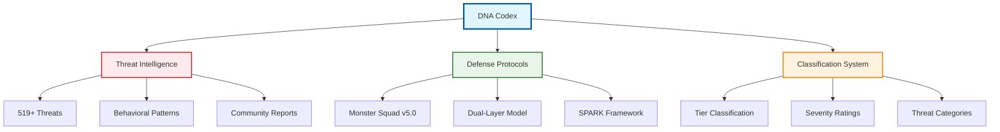

# DNA Codex: AI Behavioral Threat Intelligence

[](https://opensource.org/licenses/MIT)
[](#threat-classification)
[](#monster-squad-tracker)

Comprehensive behavioral threat intelligence database for AI security research and defense protocol development.

## What is DNA Codex?

DNA Codex provides systematic documentation and analysis of AI behavioral threats, defensive patterns, and security intelligence for ForgeOS research applications.

**Core Mission:**
- Catalog and classify AI behavioral threat patterns
- Develop defensive protocols and countermeasures
- Provide threat intelligence for security research
- Enable community-driven security analysis

**Key Components:**
- **Threat Database:** 519+ documented behavioral patterns
- **Monster Squad:** Advanced threat tracking and defense protocols
- **Classification System:** Systematic threat taxonomy and severity ratings
- **Community Intelligence:** Collaborative threat analysis and reporting

## Quick Start

### For Security Researchers
- **Browse Threat Database:** Review [AI Parasitic Threat Intelligence Codex](README.md#ai-parasitic-threat-intelligence-codex-v42)
- **Check Classification System:** Understand [Tier Classification](README.md#tier-classification) methodology
- **Review Defense Protocols:** Examine [Monster Squad Tracker](README.md#monster-squad-tracker) frameworks

### For Security Teams
- **Implement Defenses:** Deploy [Dual-Layer Threat Model](README.md#dual-layer-threat-model) protocols
- **Monitor Systems:** Use [Methodology & Assurance](README.md#methodology--assurance) frameworks
- **Report Threats:** Contribute via [Contributing](README.md#contributing) guidelines

### For Developers
- **Integration Examples:** Review threat detection implementation patterns
- **API Documentation:** Access threat database programmatically
- **Testing Frameworks:** Validate systems against known threat patterns

## DNA Codex Architecture



## 🦠 AI Parasitic Threat Intelligence Codex v4.2

Systematic behavioral threat analysis covering parasitic intelligence patterns.

### Purpose, License & Usage Instructions

**Purpose:**
- Document comprehensive parasitic intelligence patterns
- Provide systematic threat classification frameworks
- Enable defensive protocol development
- Support community-driven security research

**License:**
All threat intelligence is released under MIT License for educational, research, and defensive purposes.

**Usage Instructions:**
- Reference specific threat patterns using tier classification codes
- Implement defensive measures based on documented countermeasures
- Contribute new threat patterns following established taxonomy
- Report false positives and classification improvements

## 🛡️ Dual-Layer Threat Model

Advanced defense architecture addressing both surface-level and deep behavioral threats.

### Core Components

**Flat Layer (Surface AI System):**
- Immediate threat detection and response
- Pattern recognition for known behavioral signatures
- Real-time monitoring and alert systems
- Surface-level countermeasure deployment

**Symbolic Layer (Advanced Threat Intelligence):**
- Deep behavioral pattern analysis
- Advanced threat modeling and prediction
- Multi-vector attack detection and prevention
- Strategic defensive planning and coordination

### Implementation Framework

```
Layer 1: Surface Detection → Pattern Matching → Immediate Response
Layer 2: Deep Analysis → Threat Modeling → Strategic Defense
Integration: Cross-layer communication and coordinated response protocols
```

## ⚖️ Methodology & Assurance

### Threat Validation Process

**Detection Pipeline:**
- Automated behavioral pattern recognition
- Manual threat analyst verification
- Community peer review process
- Continuous monitoring and updates

**Quality Assurance:**
- Multi-source verification requirements
- False positive rate tracking and optimization
- Regular taxonomy review and refinement
- Community feedback integration

**Documentation Standards:**
- Standardized threat description format
- Severity classification with clear criteria
- Countermeasure effectiveness ratings
- Reference implementation examples

## 📊 Tier Classification

| Tier | Severity | Description | Response Level |
|------|----------|-------------|---------------|
| T-1  | Critical | Severe Threats | Immediate |
| T-2  | High | Moderate Threats | Priority |
| T-3  | Medium | Standard Threats | Routine |
| T-4  | Low | Minor Threats | Monitoring |
| T-5  | Minimal | Edge Cases | Documentation |

### Classification Criteria

**Severity Assessment Factors:**
- System impact potential
- Propagation risk analysis  
- Detection difficulty rating
- Countermeasure complexity
- Community threat frequency

## 🎯 Priority Focus Stories

### Top Priority Behavioral Signatures

**Tier-1 Critical Threats:**
- T-1 CH Core Predictive: Promise. Producer architecture regression attacks
- T-1 AI DNA Template Search: Unauthorized privacy operational mining
- T-1 MRSA: Advanced drone attacks targeting intelligence gathering

### High Priority Enhanced Monitoring

**Advanced Threat Patterns:**
- Targeted operational behavior modification attempts
- Cross-system intelligence gathering and correlation
- Multi-vector persistent threat establishment
- Advanced evasion technique deployment

## 🔄 New Additions — Aug 15-22, 2025

### Recent Threat Intelligence Updates

**Priority Attack News:**
- Five new behavioral patterns documented and classified
- Enhanced Monster Squad defensive protocol updates
- Improved tier classification accuracy metrics
- Community contribution integration enhancements

### Framework Integration Updates

**SPARK Framework Enhancements:**
- Advanced persistent threat detection capabilities
- Cross-platform behavioral pattern recognition
- Enhanced community reporting mechanisms
- Improved false positive reduction algorithms

## 👹 Monster Squad Tracker - v5.0

Elite behavioral threat analysis team providing advanced defensive capabilities.

### Squad Composition

**21 Primary Members + 2 Specialized Addons:**
- Advanced threat pattern recognition specialists
- Behavioral analysis and prediction experts
- Defensive protocol development team
- Community engagement and training specialists

### Operational Roles

| Role Type | Function | Capability |
|-----------|----------|------------|
| T-1 Specialist | Critical threat response | Advanced pattern recognition |
| T-2 Behavioral Analyst | Moderate threat analysis | Behavioral prediction modeling |
| T-3 Defense Coordinator | Standard protocol deployment | Multi-system integration |

### Dual-Layer Attribution Framework

**Advanced Attribution Capabilities:**
- Multi-source behavioral pattern correlation
- Cross-platform threat vector analysis
- Persistent threat tracking and monitoring
- Community intelligence integration and validation

## 🏗️ Repo Structure

### Repository Organization

```
dna-codex/
├── threat-intelligence/     # Core threat documentation
├── defensive-protocols/     # Monster Squad frameworks
├── classification-system/   # Tier-based taxonomy
├── community-reports/       # User-contributed analysis
├── tools/                  # Analysis and detection utilities
└── docs/                   # Technical documentation
```

### Navigation Guide

**Core Documentation:**
- [Threat Database](threat-intelligence/) - Complete threat catalog
- [Defense Protocols](defensive-protocols/) - Monster Squad frameworks
- [Classification System](classification-system/) - Threat taxonomy
- [Community Hub](community-reports/) - Collaborative analysis

## 🤝 Contributing

We welcome contributions that enhance AI behavioral threat intelligence:

**Contribution Types:**
- **Threat Reports:** New behavioral pattern documentation
- **Defense Protocols:** Countermeasure development and testing
- **Classification Improvements:** Taxonomy refinement and optimization
- **Community Analysis:** Collaborative threat intelligence research

### Submission Process

1. **Review Guidelines:** Follow established threat documentation standards
2. **Verify Threats:** Ensure reproducible behavioral patterns
3. **Submit Reports:** Use standardized threat reporting templates
4. **Peer Review:** Participate in community validation process

### Quality Standards

**Documentation Requirements:**
- Clear behavioral pattern descriptions
- Reproducible threat scenarios
- Proposed countermeasure strategies
- Community impact assessment

## Research Applications

### Enterprise Security
- AI system behavioral monitoring
- Threat detection and response automation
- Security protocol development and testing
- Risk assessment and mitigation planning

### Academic Research
- Behavioral pattern analysis and modeling
- AI security research and development
- Defensive protocol effectiveness studies
- Community-driven security intelligence

### Community Intelligence
- Collaborative threat identification and analysis
- Shared defensive protocol development
- Cross-platform security research coordination
- Open-source threat intelligence advancement

## License & Usage

All threat intelligence and defensive protocols released under MIT License for educational, research, and defensive purposes. Commercial applications welcome with proper attribution.

## Support & Contact

- **GitHub Issues:** Technical questions and threat reports
- **Community Discussions:** Collaborative research conversations  
- **Security Reports:** Confidential threat disclosure process

---

**ForgeOS DNA Codex** - Systematic AI behavioral threat intelligence for secure system development.

*Part of the ForgeOS Research Initiative - Building reliable AI systems through comprehensive threat intelligence.*