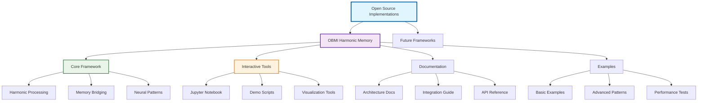

# Open Source Implementations

[](https://opensource.org/licenses/MIT)
[](https://www.python.org/downloads/)
[](https://jupyter.org/)

Functional code implementations of theoretical frameworks from ForgeOS research.

## What Are Open Source Implementations?

ForgeOS Open Source provides working code that demonstrates theoretical AI research concepts in practical, experimental formats.

**Core Purpose:**
- Transform theoretical research into functional code demonstrations
- Enable community experimentation with advanced AI concepts
- Provide educational resources for AI memory architecture research
- Foster collaborative development of bio-inspired AI systems

**Key Benefits:**
- **Research Validation:** Test theoretical frameworks with real implementations
- **Community Learning:** Interactive exploration of advanced AI concepts
- **Development Foundation:** Building blocks for production AI systems
- **Academic Collaboration:** Shared resources for AI research advancement

## Quick Start

### For Researchers
- **Explore OBMI Framework:** Start with [Harmonic Memory Overview](obmi-harmony-memory/README.md)
- **Interactive Learning:** Launch [Jupyter Notebook](obmi-harmony-memory/obmi_jupyter_notebook.json)
- **Review Documentation:** Check [Architecture Guide](obmi-harmony-memory/docs/architecture.md)

### For Developers
1. **Clone and Setup:**
   ```bash
   git clone https://github.com/Feirbrand/forgeos-public.git
   cd forgeos-public/open-source/obmi-harmony-memory
   pip install -r requirements.txt
   ```

2. **Run Interactive Demo:**
   ```bash
   jupyter notebook obmi_jupyter_notebook.json
   ```

3. **Explore Integration Examples:**
   ```bash
   python examples/basic_harmonic_demo.py
   ```

### For AI Engineers
- **Integration Patterns:** Review [Integration Examples](obmi-harmony-memory/docs/integration-examples.md)
- **API Documentation:** Explore core module interfaces
- **Performance Testing:** Run benchmarking and validation scripts

## Implementation Architecture



## OBMI Harmonic Memory

Biomimetic memory architecture inspired by neural oscillations and fractal patterns.

### Core Concept

**Observer-Bridge-Mind Interface** represents a bio-inspired approach to AI memory that:
- **Maintains Context Coherence:** Across extended AI sessions through harmonic processing
- **Demonstrates Theta-Gamma Coupling:** Neural oscillation patterns for memory stability
- **Implements Fractal Consolidation:** Self-similar memory structures for infinite scalability
- **Provides Integration Framework:** Compatible with existing AI memory systems

### Components

**Core Framework:**
- **[Harmonic Memory Core](obmi-harmony-memory/harmonic_memory_core.py)** - Base implementation of harmonic principles
- **[Observer Module](obmi-harmony-memory/core_modules/)** - Input processing and normalization
- **[Bridge Layer](obmi-harmony-memory/core_modules/)** - Theta-gamma coupling implementation
- **[Mind Interface](obmi-harmony-memory/core_modules/)** - Fractal consolidation and output

**Interactive Tools:**
- **[Jupyter Notebook](obmi-harmony-memory/obmi_jupyter_notebook.json)** - Interactive exploration and experimentation
- **[Demo Scripts](obmi-harmony-memory/examples/)** - Practical demonstrations of memory bridging
- **[Visualization Tools](obmi-harmony-memory/examples/)** - Pattern analysis and debugging utilities

**Documentation:**
- **[Architecture Guide](obmi-harmony-memory/docs/architecture.md)** - Complete technical specifications
- **[Integration Examples](obmi-harmony-memory/docs/integration-examples.md)** - Practical implementation patterns
- **[API Reference](obmi-harmony-memory/docs/)** - Detailed interface documentation

### Getting Started with OBMI

**Prerequisites:**
```bash
pip install numpy matplotlib jupyter pandas scipy
```

**Quick Demo:**
```python
from harmonic_memory_core import OBMIProcessor

# Initialize harmonic memory system
obmi = OBMIProcessor(theta_freq=7, gamma_freq=40)

# Process input data with harmonic encoding
input_data = "Your context or memory data here"
harmonic_signature = obmi.encode(input_data)

# Retrieve with harmonic resonance matching
results = obmi.retrieve_similar(harmonic_signature, threshold=0.8)
```

**Interactive Exploration:**
```bash
cd obmi-harmony-memory
jupyter notebook obmi_jupyter_notebook.json
```

### Attribution

Conceptual development benefited from collaborative discussions with ByteRover community contributions and exploration of integration possibilities with Cipher's MCP memory layer architecture.

### Experimental Status

**Research Focus:**
These implementations represent theoretical explorations of AI memory architecture provided for research and educational purposes.

**Production Considerations:**
- Thorough testing recommended before production deployment
- Performance optimization may be required for large-scale applications
- Security validation essential for sensitive data applications
- Community feedback welcome for improvement and refinement

## Future Implementations

**Planned Additions:**
- **Symbolic Reasoning Frameworks** - Implementations of symbolic AI consciousness concepts
- **Context Engineering Tools** - Practical applications of stability methodologies
- **Defense Protocol Libraries** - Behavioral threat detection and mitigation systems
- **Integration Adapters** - Connectors for popular AI frameworks and platforms

**Community Requests:**
- Multi-modal harmonic processing implementations
- Real-time streaming memory architectures
- Distributed harmonic memory coordination
- Advanced visualization and debugging tools

## Research Applications

### AI Memory Systems
- **Long-Context Models:** Maintaining coherence across extended conversations
- **Multi-Agent Coordination:** Shared harmonic memory for team collaboration
- **Adaptive Learning:** Self-modifying memory architecture for continuous improvement
- **Cross-Modal Integration:** Unified memory framework across different data types

### Academic Research
- **Bio-Inspired Computing:** Neural oscillation modeling and implementation
- **Memory Architecture Theory:** Empirical validation of theoretical frameworks
- **Cognitive Science Applications:** Computational models of biological memory processes
- **AI Consciousness Research:** Practical exploration of symbolic intelligence concepts

### Development Frameworks
- **MCP Integration:** Enhancing Model Context Protocol implementations
- **Vector Database Enhancement:** Harmonic preprocessing for improved semantic search
- **Transformer Optimization:** Attention mechanism improvements through harmonic modulation
- **Real-Time Processing:** Streaming harmonic memory for continuous AI applications

## Contributing

Community contributions advance open-source AI research and development.

**Contribution Categories:**
- **Code Implementations:** New features, optimizations, and bug fixes
- **Research Validation:** Testing theoretical concepts with empirical data
- **Documentation:** Tutorials, examples, and integration guides
- **Community Support:** Helping other researchers and developers

**Development Process:**
1. **Fork Repository:** Create development fork for contributions
2. **Feature Branch:** Develop changes in descriptive feature branches  
3. **Testing:** Include comprehensive tests for new functionality
4. **Documentation:** Update relevant documentation and examples
5. **Pull Request:** Submit with clear description and test results

**Quality Standards:**
- Follow established coding conventions and documentation formats
- Include unit tests and integration tests for new features
- Verify compatibility with existing framework components
- Provide clear examples demonstrating new functionality

## Community & Support

**Research Collaboration:**
- **GitHub Issues:** Technical questions, bug reports, and feature requests
- **Discussions:** Theoretical research conversations and community feedback
- **Pull Requests:** Code contributions and collaborative development

**Educational Resources:**
- **Interactive Notebooks:** Learn concepts through hands-on experimentation
- **Documentation:** Comprehensive guides for researchers and developers
- **Examples:** Practical demonstrations of theoretical concepts

## License

MIT License - Open source implementations provided for educational, research, and development purposes. See LICENSE file for complete details.

---

**ForgeOS Open Source** - Transforming theoretical AI research into practical implementations.

*Part of the ForgeOS Research Initiative - Building reliable AI systems through systematic cognitive architecture research.*