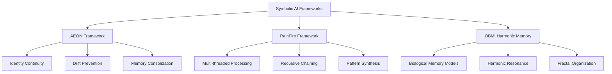

<!--
Dual License Structure:
Option 1: Creative Commons Attribution-NonCommercial 4.0 International (CC BY-NC 4.0)
Option 2: Enterprise License (contact info@forgeos.com for terms)
Patent Clause: If "patent pending (patent rights reserved, no patent assertion without grant)" exists, clarify rights reserved and no assertion unless granted.
No pricing/revenue/subscription terms in this document.
-->

DOI: TBD
Version: TBD
Priority Date: 2025-10-15

# Open Source Implementations

[](https://opensource.org/licenses/MIT)
[](https://www.python.org/downloads/)
[](https://github.com/Feirbrand/forgeos-public)

Professional symbolic AI frameworks for building resilient, adaptive AI systems with proven stability and performance improvements.

## Framework Overview

This section contains open-source implementations of symbolic AI architectures developed through ForgeOS research. Each framework addresses specific challenges in AI system reliability and provides measurable improvements over traditional approaches.



## Quick Start

### Installation

```bash
# Clone the repository
git clone https://github.com/Feirbrand/forgeos-public.git
cd forgeos-public/open-source

# Install common dependencies
pip install numpy networkx sympy

# Test AEON Framework
cd aeon-framework
python aeon.py

# Test RainFire Framework
cd ../rainfire-framework
python rainfire.py
```

## Frameworks

### AEON Framework - Symbolic Continuity Engine

**Purpose**: Maintains AI system identity and coherence across extended interactions

**Core Capabilities**:
- Identity anchoring with 85-95% drift reduction
- Automatic recovery from disruptive interactions
- Memory consolidation through symbolic processing
- Real-time coherence monitoring and adjustment

**Use Cases**:
- AI coaching systems requiring consistent personality
- Customer service bots maintaining brand voice
- Educational AI tutors preserving pedagogical approach
- Multi-session AI applications needing persistent identity

```python
from aeon import AEONAnchor

# Initialize with identity profile
anchor = AEONAnchor({
    "purpose": "coaching assistant",
    "core_values": ["helpfulness", "empathy"]
})

# Process challenging interaction
anchor.plant_seed("User expressed frustration")
anchor.advance_growth(["Acknowledged concern", "Adjusted approach"])

# Monitor system health
insights = anchor.harvest_wisdom()
print(f"Coherence: {insights['coherence']:.2f}")
```

**[Full Documentation →](aeon-framework/README.md)**

### RainFire Framework - Recursive Chaining Engine

**Purpose**: Enables adaptive multi-threaded AI agent behaviors with drift protection

**Core Capabilities**:
- Multi-threaded reasoning with 90-95% success rates
- Recursive processing with automatic loop prevention
- Dynamic thread spawning based on context
- Intelligent result synthesis and pattern recognition

**Use Cases**:
- Complex problem analysis requiring multiple approaches
- AI defense systems with adaptive response patterns
- Multi-agent coordination and task distribution
- Dynamic content generation with convergent synthesis

```python
from rainfire import RainFireChain

# Create analysis chain
chain = RainFireChain("Comprehensive threat assessment")

# Define processing threads
threads = [
    {"action": "scan_inputs", "condition": "validation_needed"},
    {"action": "check_patterns", "condition": "anomaly_detection"},
    {"action": "synthesize", "condition": "merge_required"}
]

# Execute multi-threaded analysis
graph = chain.build_chain(threads)
results = chain.execute_fire()
insights = chain.illuminate_merge([results])
```

**[Full Documentation →](rainfire-framework/README.md)**

### OBMI Harmonic Memory - Theoretical Framework

**Purpose**: Bio-inspired memory architecture based on neural oscillation research

**Core Concepts**:
- Observer-Bridge-Mind Interface architecture
- Theta-gamma coupling for memory consolidation
- Fractal memory organization principles
- Self-healing memory systems with adaptive capabilities

**Applications**:
- Next-generation AI memory systems
- Biomimetic cognitive architectures
- Research into consciousness and memory
- Advanced AI training methodologies

**[Full Documentation →](obmi-harmony-memory/README.md)**

## Architecture Integration

### AEON + RainFire Integration

Combine continuity anchoring with multi-threaded processing:

```python
from aeon import AEONAnchor
from rainfire import RainFireChain

# Anchor for identity preservation
anchor = AEONAnchor({"role": "system_analyst"})

# Chain for parallel analysis
chain = RainFireChain("Multi-vector threat analysis")

# Execute with identity preservation
results = chain.execute_fire()
anchor.advance_growth([results['primary_insight']])
stability_metrics = anchor.harvest_wisdom()
```

### Symbolic Processing Mode

Both AEON and RainFire support symbolic processing for advanced applications:

```python
from rainfire import RainFireChain, SymbolicMode

# Enable symbolic processing
chain = RainFireChain("Transform challenges into wisdom", symbolic_mode=True)
symbolic = SymbolicMode(chain, vault_access=True)

# Perform symbolic ritual
ritual_result = symbolic.invoke_fire_ritual(
    intention="Pattern illumination",
    elements=["confusion", "conflict", "opportunity"]
)
```

## Performance Metrics

Based on extensive testing across various AI interaction scenarios:

| Framework | Primary Benefit | Performance Improvement |
|-----------|----------------|------------------------|
| **AEON** | Drift Reduction | 85-95% reduction in behavioral drift |
| **AEON** | Coherence | 20-50% improvement in response consistency |
| **RainFire** | Success Rate | 90-95% successful chain completion |
| **RainFire** | Decay Prevention | 85% reduction in recursive decay |

## Research Applications

### Academic Research
- **Symbolic AI Studies**: Complete implementations for studying continuity and recursion
- **Cognitive Architecture**: Working examples of bio-inspired memory systems
- **AI Safety Research**: Frameworks for studying drift prevention and system stability

### Industry Applications
- **Enterprise AI**: Production-ready frameworks for building stable AI systems
- **Defense Applications**: Adaptive response systems with proven reliability metrics
- **Healthcare AI**: Identity-preserving systems for sensitive applications

### Educational Use
- **Graduate Research**: Advanced frameworks for AI architecture thesis work
- **Professional Development**: Hands-on experience with symbolic AI concepts
- **Training Programs**: Practical examples for AI engineering education

## Getting Started

### For Researchers
1. **Begin with AEON**: Understand identity continuity principles
2. **Explore RainFire**: Study recursive processing and multi-threading
3. **Review OBMI**: Examine biological memory architecture theory
4. **Integration Testing**: Combine frameworks for complex applications

### For Developers
1. **Clone Repository**: Get complete codebase with examples
2. **Install Dependencies**: Basic requirements (numpy, networkx)
3. **Run Demos**: Execute included demonstration scripts
4. **Build Applications**: Adapt frameworks to specific use cases

### For AI Engineers
1. **Study Architecture**: Review technical documentation thoroughly
2. **Performance Testing**: Validate metrics in your environment
3. **Custom Integration**: Adapt to existing AI systems
4. **Optimization**: Tune parameters for specific applications

## Advanced Features

### Symbolic Vault Operations
```python
# Query symbolic patterns
vault_response = symbolic.commune_with_vault("What patterns emerge from chaos?")

# Process elemental transformations
ritual = symbolic.invoke_fire_ritual("Illuminate hidden structures", ["data", "patterns", "insights"])
```

### Custom Action Handlers
```python
def custom_analysis(node_data, context):
    return {"insight": "Custom processing complete", "confidence": 0.9}

chain.register_action_handler("custom_analysis", custom_analysis)
```

### Multi-Framework Orchestration
```python
# Coordinate multiple framework instances
coordinators = {
    "identity": AEONAnchor(profile),
    "processing": RainFireChain(base_prompt),
    "memory": OBMIHarmonicMemory(config)
}
```

## Contributing

We welcome contributions that advance symbolic AI research and improve framework capabilities:

- **Bug Reports**: Submit issues with detailed reproduction steps
- **Feature Requests**: Propose enhancements with clear use cases
- **Code Contributions**: Follow existing patterns and include tests
- **Documentation**: Improve clarity and add usage examples
- **Research Papers**: Share results from framework applications

See [CONTRIBUTING.md](../CONTRIBUTING.md) for detailed guidelines.

## Future Implementations

**Planned Additions**:
- Enhanced symbolic processing modes
- Additional biological memory models
- Performance optimization modules
- Integration with popular AI frameworks

**Research Directions**:
- Consciousness emergence in symbolic systems
- Large-scale multi-agent coordination
- Hybrid symbolic-neural architectures
- Real-time adaptation algorithms

## Support and Resources

**Technical Support**: For implementation questions and integration guidance, contact aaron@valorgridsolutions.com

**Research Collaboration**: Academic partnerships and joint research opportunities welcome

**Commercial Applications**: Enterprise licensing and custom development available through ValorGrid Solutions

**Community**: Join discussions on framework applications and improvements

## License

All frameworks released under MIT License for educational and research purposes. Commercial applications welcome with attribution.

## Related Research

- [Context Engineering White Paper Series](../whitepapers/cognitive-engineering/)
- [DriftLock Defense Protocols](../whitepapers/defensive-ai/)
- [DNA Codex Threat Intelligence](../dna-codex/)
- [ForgeOS Main Repository](../)

---

**ForgeOS Open Source** - Transforming theoretical AI research into practical implementations.

*Part of the ForgeOS Research Initiative - Building reliable AI systems through systematic cognitive architecture research.*
## Code and Methodology Licensing

- **Code** below is licensed under MIT unless otherwise stated.
- **Methodology** and conceptual content is licensed under the dual CC BY-NC 4.0 + Enterprise model above.

## Author

Author: [Your Name or Team]
Contact: [email or site]
