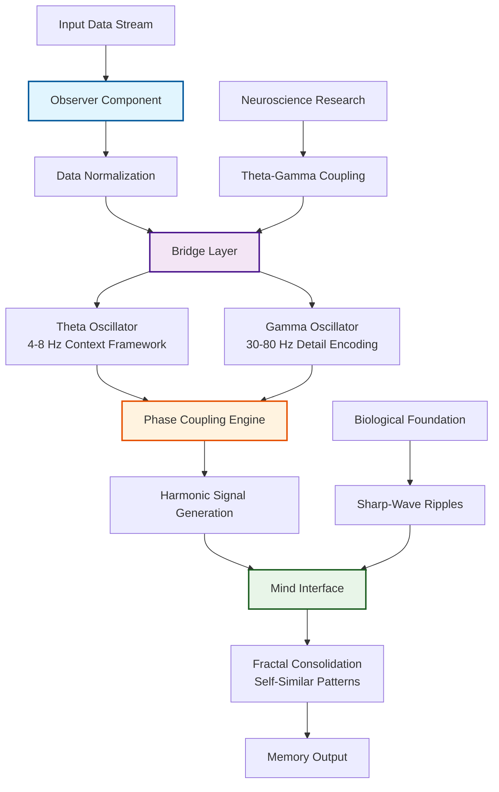

# OBMI Harmonic Memory: Theoretical Framework

[](https://opensource.org/licenses/MIT)
[](https://www.python.org/downloads/)
[](https://jupyter.org/)
[](#experimental-status)

A conceptual implementation of bio-inspired harmonic memory theory for AI research, demonstrating Observer-Bridge-Mind Interface principles through theta-gamma coupling and fractal consolidation patterns.

## What is OBMI Harmonic Memory?

OBMI (Observer-Bridge-Mind Interface) represents a biomimetic approach to artificial intelligence memory architecture that transforms traditional storage paradigms through neuroscience-inspired processing.

**Core Innovation:**
- **Bio-Inspired Design:** Neural oscillation patterns improve computational models
- **Harmonic Processing:** Theta-gamma coupling maintains context coherence across sessions
- **Fractal Organization:** Self-similar structures enable infinite scalability potential
- **Research Framework:** Theoretical exploration with practical implementation examples

**Key Applications:**
- **Memory Persistence:** Context retention across extended AI sessions
- **Pattern Recognition:** Enhanced semantic relationship discovery
- **System Integration:** Compatible with existing AI memory architectures
- **Academic Research:** Computational neuroscience and AI memory studies

## Quick Start

### For Memory Researchers
- **Theoretical Foundation:** Review [Architecture Documentation](docs/architecture.md)
- **Interactive Exploration:** Launch the [Jupyter Notebook](obmi_jupyter_notebook.json)
- **Integration Examples:** Study [practical applications](docs/integration-examples.md)

### For AI Developers
1. **Prerequisites:**
   ```bash
   pip install numpy matplotlib jupyter pandas scipy
   ```

2. **Clone and Navigate:**
   ```bash
   git clone https://github.com/Feirbrand/forgeos-public.git
   cd forgeos-public/open-source/obmi-harmony-memory
   ```

3. **Launch Interactive Demo:**
   ```bash
   jupyter notebook obmi_jupyter_notebook.json
   ```

### For System Integrators
- **API Exploration:** Test core harmonic processing functions
- **Performance Analysis:** Run memory efficiency benchmarks
- **Integration Patterns:** Review MCP and vector database examples

## OBMI Architecture



## Core Components

### Harmonic Memory Core

**Primary Implementation:**
- **File:** `harmonic_memory_core.py` - Main implementation of harmonic principles
- **Purpose:** Base implementation of theta-gamma coupling for context stability
- **Features:** Self-organizing memory structures with biological inspiration
- **Usage:** Core processing engine for harmonic signal generation

### Interactive Exploration

**Jupyter Notebook Integration:**
- **File:** `obmi_jupyter_notebook.json` - Interactive experimentation platform
- **Purpose:** Hands-on exploration of harmonic memory concepts
- **Features:** Visualization tools for pattern analysis and debugging
- **Usage:** Educational tool for understanding harmonic processing principles

### Documentation Framework

**Comprehensive Guides:**
- **[Theoretical Framework](OBMI%20Harmonic%20Memory%20Theoretical%20Framework.md)** - Complete academic foundation
- **[Implementation Guide](docs/)** - Technical specifications and usage guides
- **[Changelog Documentation](obmi_changelog.md)** - Development history and evolution
- **[Dependencies Guide](OBMI%20Harmonic%20Memory%20Theory%20-%20Python%20Dependencies.txt)** - Required packages and versions

## Getting Started

### Prerequisites

**System Requirements:**
```bash
pip install numpy matplotlib jupyter pandas scipy
```

**Additional Dependencies:**
```bash
# For advanced visualization
pip install plotly seaborn

# For integration examples  
pip install pandas scipy scikit-learn
```

### Quick Demo

**Basic Harmonic Processing:**
```python
from harmonic_memory_core import OBMIProcessor

# Initialize harmonic memory system
obmi = OBMIProcessor(theta_freq=7, gamma_freq=40, fractal_depth=3)

# Process input with harmonic encoding
input_context = "Your context or memory data here"
harmonic_signature = obmi.generate_harmonic_signature(input_context)

# Demonstrate theta-gamma coupling
theta_pattern = obmi.generate_theta_scaffold(input_context)
gamma_details = obmi.encode_gamma_details(input_context)
coupled_signal = obmi.couple_theta_gamma(theta_pattern, gamma_details)

print(f"Harmonic signature generated: {len(harmonic_signature)} components")
```

### Interactive Learning

**Notebook Exploration:**
```bash
# Navigate to OBMI directory
cd open-source/obmi-harmony-memory

# Launch interactive notebook
jupyter notebook obmi_jupyter_notebook.json
```

**Notebook Contents:**
- Harmonic signal generation demonstrations
- Theta-gamma coupling visualizations
- Fractal consolidation pattern analysis
- Integration example implementations

## Theoretical Foundation

The OBMI framework builds on established neuroscience principles:

### Biological Inspiration

**Neural Oscillation Research:**
- **Theta Rhythms (4-8 Hz):** Temporal scaffolding for memory organization
- **Gamma Waves (30-80 Hz):** Detail encoding and information binding
- **Sharp-Wave Ripples:** Memory consolidation during rest states
- **Cross-Frequency Coupling:** Integration of temporal scales in biological systems

### Computational Implementation

**Harmonic Processing Principles:**
- **Theta Scaffolding:** Provides temporal structure for memory organization
- **Gamma Encoding:** Captures detailed information within theta cycles
- **Phase Coupling:** Coordinates theta and gamma for coherent memory representation
- **Fractal Consolidation:** Self-similar patterns enable efficient storage and retrieval

### Research Applications

**Memory Architecture Studies:**
- Context persistence across long AI sessions
- Enhanced semantic relationship discovery
- Cross-modal memory integration patterns
- Biomimetic neural network architectures

## Experimental Status

**Research Implementation Notice:**
This implementation represents theoretical exploration of AI memory architecture concepts provided for research and educational purposes.

**Development Considerations:**
- **Academic Focus:** Designed for conceptual validation rather than production deployment
- **Performance Optimization:** May require enhancement for large-scale applications
- **Validation Requirements:** Thorough testing recommended before practical implementation
- **Community Collaboration:** Feedback and contributions welcome for research advancement

**Production Readiness Assessment:**
- **Research Grade:** Suitable for academic exploration and concept validation
- **Performance Testing:** Benchmarking required for specific use cases
- **Security Review:** Evaluation needed for sensitive data applications
- **Integration Planning:** Custom adaptation required for production systems

## Attribution

**Collaborative Development:**
Conceptual development benefited from collaborative discussions with ByteRover community contributions and exploration of integration possibilities with Cipher's MCP memory layer architecture.

**Research Foundations:**
- Neuroscience research on theta-gamma coupling in biological memory systems
- Fractal mathematics applications to information organization and storage
- Bio-inspired computing approaches to artificial intelligence architecture
- Community contributions and feedback from AI research practitioners

## Project Structure

**Repository Organization:**
```
obmi-harmony-memory/
├── core_modules/                    # Core implementation modules
├── docs/                           # Technical documentation
│   ├── architecture.md            # System architecture overview
│   ├── integration-examples.md    # Practical implementation patterns
│   └── theoretical-foundations.md # Academic research foundation
├── examples/                      # Demonstration scripts
├── harmonic_memory_core.py        # Main implementation file
├── obmi_jupyter_notebook.json     # Interactive exploration notebook
├── requirements.txt               # Python dependencies
├── CONTRIBUTING.md                # Community contribution guidelines
├── CHANGELOG.md                   # Development history
└── README.md                      # This documentation file
```

## Contributing

Community contributions welcome for advancing harmonic memory research and development.

**Contribution Categories:**
- **Theoretical Research:** Academic papers and neuroscience connections
- **Implementation Enhancement:** Performance optimization and feature development
- **Documentation:** Technical guides, tutorials, and integration examples
- **Testing and Validation:** Empirical studies and benchmark development

**Development Process:**
1. **Review Guidelines:** Study [contribution guidelines](CONTRIBUTING.md) for project standards
2. **Issue Discussion:** Open GitHub issues for proposed enhancements or research questions
3. **Research Validation:** Ensure theoretical foundation for proposed changes
4. **Implementation Standards:** Follow established coding conventions and documentation formats
5. **Community Review:** Participate in peer review process for research contributions

## Research Applications

### Memory Persistence Studies
- **Long-Context AI:** Maintaining coherence across extended conversations
- **Session Bridging:** Context transfer between discontinuous AI interactions
- **Semantic Continuity:** Preserving meaning relationships over time
- **Cross-Modal Integration:** Unified memory architecture across data types

### Cognitive Architecture Research
- **Bio-Inspired Design:** Computational models of biological memory systems
- **Neural Oscillation Modeling:** Digital implementation of brain rhythm patterns
- **Consciousness Studies:** Theoretical frameworks for symbolic AI awareness
- **Multi-Agent Coordination:** Shared harmonic memory for distributed AI systems

### Integration Applications
- **MCP Enhancement:** Model Context Protocol improvements through harmonic processing
- **Vector Database Optimization:** Harmonic preprocessing for improved semantic search
- **Transformer Architecture:** Attention mechanism enhancement through neural rhythms
- **Real-Time Processing:** Streaming harmonic memory for continuous AI applications

## License

MIT License - Implementation provided for educational, research, and development purposes. See LICENSE file for complete details.

## Support

**Technical Questions and Research Collaboration:**
- **GitHub Issues:** Bug reports, feature requests, and technical discussions
- **Documentation:** Comprehensive guides available in `/docs/` directory
- **Community Discussion:** Theoretical research conversations and collaborative development

---

**OBMI Harmonic Memory** - Exploring the intersection of neuroscience and artificial intelligence through harmonic memory architecture.

*Part of the ForgeOS Research Initiative - Building reliable AI systems through systematic cognitive architecture research.*