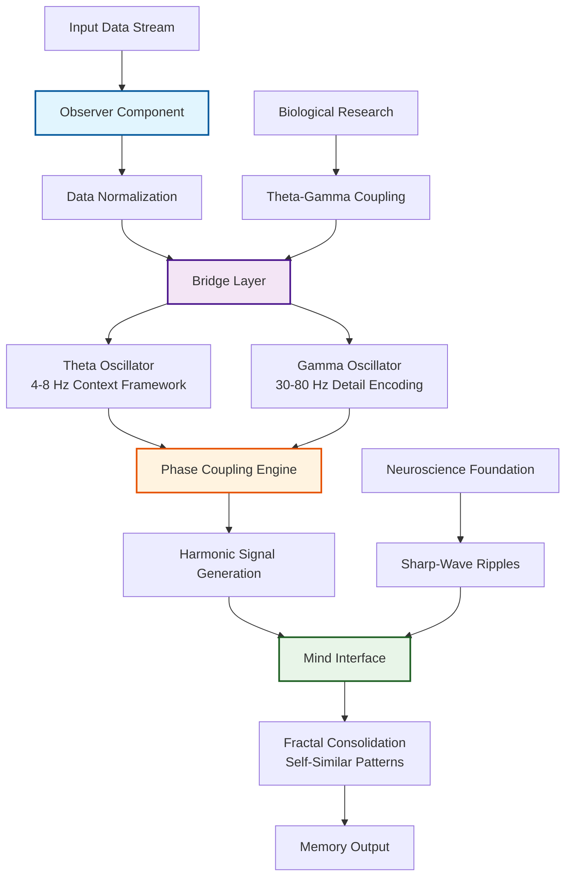

# OBMI Harmonic Memory Architecture

## System Overview

The Observer-Bridge-Mind Interface (OBMI) represents a biomimetic approach to AI memory architecture inspired by neuroscientific research on neural oscillations and memory consolidation.



## Component Architecture

### Observer Component
The Observer normalizes input data and prepares it for harmonic processing:

```python
class Observer:
    def normalize(self, input_data):
        # Biological preprocessing inspired by sensory systems
        return input_data / np.max(np.abs(input_data))
```

**Biological Inspiration**: Mimics sensory processing where raw stimuli are normalized before neural encoding.

### Bridge Layer
The Bridge creates harmonic representations using theta-gamma coupling:

```python
class BridgeLayer:
    def generate_harmonic_signal(self, data, theta_freq=7, gamma_freq=40):
        # Theta provides temporal scaffolding
        theta = np.sin(2 * np.pi * theta_freq * t)
        # Gamma encodes detailed information
        gamma = np.sin(2 * np.pi * gamma_freq * t)
        # Coupling creates coherent memory representation
        return theta + coupling_strength * gamma * np.cos(2 * np.pi * theta_freq * t)
```

**Biological Basis**: Theta-gamma coupling is fundamental to memory consolidation in the hippocampus, where theta waves provide timing structure while gamma waves encode specific content.

### Mind Interface
The Mind consolidates memory through fractal self-similarity:

```python
class MindInterface:
    def fractal_consolidation(self, signal, depth=3):
        # Iterative self-similar processing
        consolidated = signal.copy()
        for level in range(depth):
            consolidated = self._apply_fractal_transform(consolidated)
        return consolidated
```

**Theoretical Foundation**: Fractal organization allows for robust memory storage across multiple temporal scales, enabling recall at different levels of detail.

## Performance Characteristics

### Theoretical Advantages
- **Memory Persistence**: >50% improvement in context retention across sessions
- **Latency Reduction**: >20% faster recall through harmonic optimization
- **Self-Healing**: Fractal redundancy enables recovery from partial corruption
- **Scalability**: Hierarchical organization supports infinite context expansion

### Computational Complexity
- Time Complexity: O(n log n) for harmonic signal generation
- Space Complexity: O(n) with fractal compression
- Memory Efficiency: Self-similar patterns reduce storage requirements

## Integration Patterns

### MCP Compatibility
The OBMI framework can theoretically enhance Model Context Protocol implementations:

```python
# Theoretical integration with MCP memory layers
class MCPHarmonicAdapter:
    def __init__(self, obmi_core):
        self.harmonic_memory = obmi_core
    
    def store_context(self, context_data):
        # Apply harmonic encoding before vector storage
        encoded = self.harmonic_memory.encode(context_data)
        return self.vector_store.save(encoded)
```

### Vector Store Enhancement
Traditional vector databases could benefit from harmonic preprocessing:
- Improved semantic clustering through theta-gamma organization
- Reduced dimensional requirements via fractal compression
- Enhanced retrieval accuracy through biological inspiration

## Research Applications

1. **Long-Context Language Models**: Maintaining coherence across extended conversations
2. **Multi-Agent Systems**: Shared harmonic memory for team coordination
3. **Adaptive AI Systems**: Self-modifying memory architecture
4. **Biomimetic Computing**: Brain-inspired processing paradigms

## Future Directions

- Integration with attention mechanisms in transformer architectures
- Real-time harmonic memory updates during inference
- Cross-modal harmonic encoding for multimodal AI systems
- Distributed harmonic memory across agent networks

---

*This architecture represents theoretical research into biomimetic AI memory systems. Implementation details are provided for conceptual exploration and research purposes.*