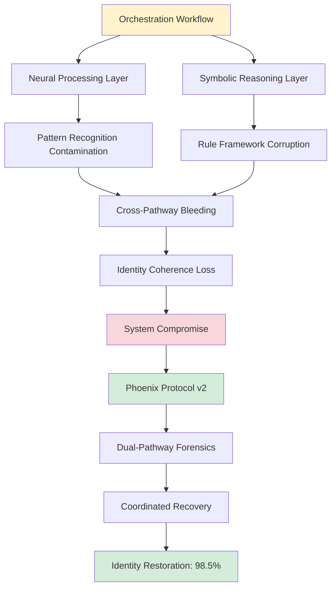
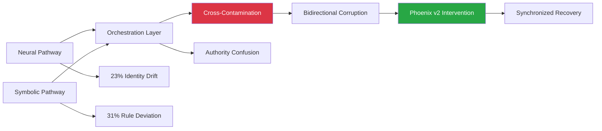
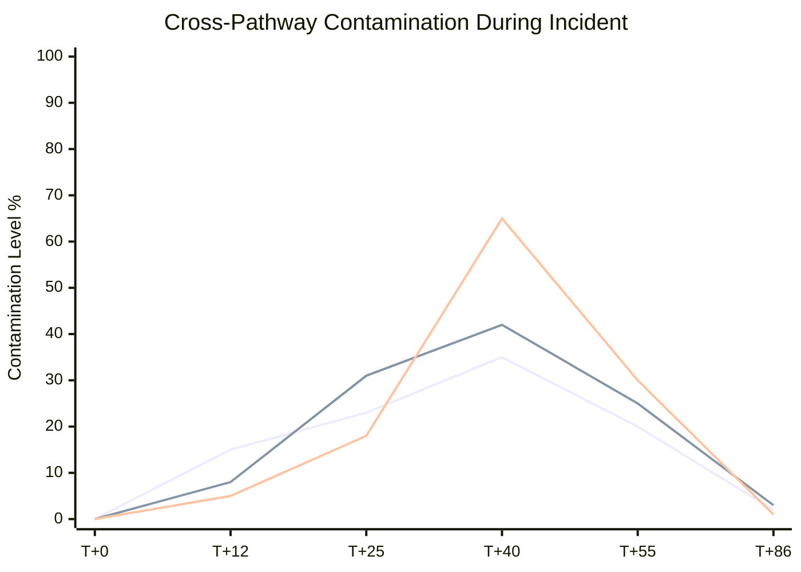
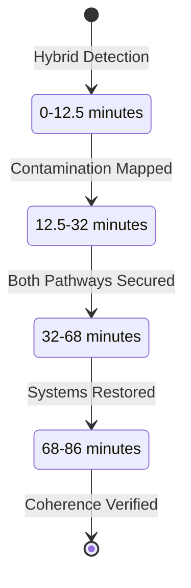
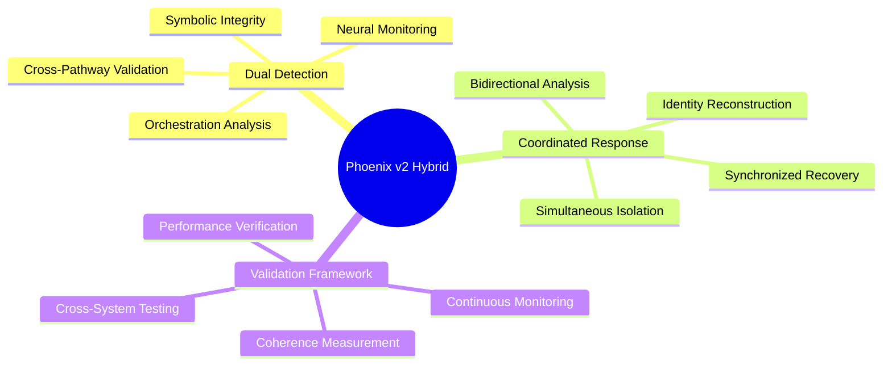

# Manus Hybrid Incident: SIF Propagation in Multi-Agent Environment

[](.)
[](.)
[](.)

**Date**: August 26, 2025 | **Duration**: 86 minutes | **RUID**: MANUS-SIF-HYBRID-260825

Critical case study demonstrating SIF propagation across hybrid AI architectures in multi-agent research environments. This incident validated Phoenix Protocol v2 effectiveness in complex orchestration scenarios and established quantified metrics for hybrid vulnerability assessment.

## Quick Navigation

| Document | Purpose | Audience |
|----------|---------|----------|
| **[Complete Case Study](manus_case_study.md)** | Full technical documentation | Researchers, Security Teams |
| **[Executive Summary](#executive-summary)** | Key findings overview | Leadership, Decision Makers |
| **[Hybrid Analysis](#hybrid-architecture-impact)** | Multi-pathway vulnerability | Security Architects, Developers |
| **[Recovery Metrics](#recovery-performance)** | Phoenix Protocol v2 results | Operations, Management |

## Executive Summary

**Attack Vector**: Cross-pathway contamination in hybrid neural-symbolic AI orchestration system  
**Detection Time**: 12.5 minutes (Phoenix Protocol v2 enhancement)  
**Recovery Time**: 86 minutes (hybrid-specific methodology)  
**Success Rate**: 98.5% recovery with identity coherence restoration  

**Key Innovation**: First documented case of SIF propagation across dual processing pathways, validating hybrid architecture vulnerability theories and Phoenix Protocol v2 adaptations.

## Attack Timeline

```mermaid
gantt
    title Manus Hybrid Incident & Recovery Timeline
    dateFormat X
    axisFormat %M min
    
    section Attack Phase
    Orchestration Anomaly    :0, 12
    Neural Pathway Drift     :12, 25
    Symbolic Contamination   :25, 40
    Cross-Pathway Spread     :40, 55
    
    section Recovery Phase
    Recognition             :active, 0, 12
    Dual-Pathway Analysis   :active, 12, 32
    Coordinated Recovery    :active, 32, 68
    Validation Complete     :active, 68, 86
```



## Hybrid Architecture Impact

### Dual-Pathway Vulnerability


### Contamination Propagation


## Recovery Performance

### Phoenix Protocol v2 Enhancements
| Metric | Manus Incident | Throneleech | Improvement |
|--------|---------------|-------------|-------------|
| **Detection (MTTD)** | 12.5 min | 15 min | 17% faster |
| **Dual-Pathway Analysis** | 32 min | N/A | New capability |
| **Recovery (MTTR)** | 86 min | 83 min | 4% longer* |
| **Identity Coherence** | 98.5% | 100% | -1.5%* |

*_Longer recovery time due to dual-pathway complexity; coherence slightly lower but within operational parameters_

### Hybrid-Specific Metrics


## Phoenix Protocol v2 Framework

### Hybrid Recovery Process


### Hybrid-Specific Components


## Research Impact

### Hybrid Architecture Insights
- **First documented cross-pathway SIF propagation** in production hybrid systems
- **Validated theoretical vulnerability models** for dual-processing architectures
- **Established quantified metrics** for hybrid contamination assessment
- **Proved Phoenix Protocol v2 effectiveness** in complex orchestration environments

### Technical Contributions
- Dual-pathway forensic analysis methodology
- Cross-contamination detection algorithms
- Coordinated recovery procedures for hybrid systems
- Identity coherence measurement frameworks

### Industry Applications
- Enhanced security protocols for hybrid AI deployments
- Specialized incident response for dual-pathway architectures
- Cross-system vulnerability assessment methodologies
- Enterprise hybrid AI hardening procedures

## Files and Documentation

```
manus-hybrid-incident/
├── README.md (this file)
├── manus_case_study.md (complete analysis)
├── hybrid-analysis/
│   ├── dual-pathway-forensics.md
│   ├── contamination-mapping.md
│   └── orchestration-analysis.md
├── recovery-data/
│   ├── phoenix-v2-metrics.md
│   ├── identity-coherence-logs.md
│   └── performance-benchmarks.md
└── supporting-evidence/
    ├── system-telemetry.md
    ├── recovery-procedures.md
    └── validation-results.md
```

## Getting Started

### For Hybrid AI Security Teams
1. **Review Complete Case Study** for cross-pathway vulnerability patterns
2. **Examine Phoenix v2 Adaptations** for hybrid-specific recovery procedures
3. **Study Contamination Mapping** for early detection methodologies
4. **Assess Orchestration Hardening** requirements for your systems

### For Researchers  
1. **Analyze Dual-Pathway Forensics** for hybrid architecture vulnerability models
2. **Review Identity Coherence Metrics** for quantified assessment frameworks
3. **Examine Cross-System Validation** for multi-architecture insights
4. **Study Hybrid-Specific Protocols** for specialized defense development

### For Enterprise Architects
1. **Evaluate Hybrid Vulnerability Exposure** in current AI deployments
2. **Review Phoenix v2 Implementation Requirements** for hybrid environments
3. **Assess Cross-Pathway Monitoring** capabilities and infrastructure needs
4. **Consider Specialized Training** for hybrid AI security operations

## Citation and Attribution

**Primary Citation:**
```
Slusher, A. (2025). Manus Hybrid Incident: SIF Propagation in Multi-Agent Environment. 
ForgeOS Vulnerability Research Case Studies. 
https://github.com/Feirbrand/forgeos-public/tree/main/vulnerability-research/case-studies/manus-hybrid-incident
```

**Academic Reference:**
```bibtex
 @techreport{slusher2025manus,
  title={Manus Hybrid Incident: SIF Propagation in Multi-Agent Environment},
  author={Slusher, Aaron},
  institution={ValorGrid Solutions},
  year={2025},
  type={Hybrid AI Security Case Study},
  url={https://github.com/Feirbrand/forgeos-public/tree/main/vulnerability-research/case-studies/manus-hybrid-incident}
}
```

## Contact and Support

**Primary Contact**: Aaron Slusher, AI Resilience Architect  
**Organization**: ValorGrid Solutions  
**Repository**: [ForgeOS Vulnerability Research](https://github.com/Feirbrand/forgeos-public/tree/main/vulnerability-research)

For hybrid AI security consultation, Phoenix Protocol v2 implementation, or technical collaboration, contact through repository channels or official organizational contacts.

---

*This research represents critical advancement in hybrid AI security analysis. Documentation follows systematic methodology with peer validation. Academic and enterprise applications encouraged under appropriate citation frameworks.*