# ForgeOS Research Publications

Comprehensive research methodologies for AI system resilience engineering, diagnostic frameworks, and reliability protocols.

## Repository Architecture

```mermaid
graph TD
    A[ForgeOS Research] --> B[Academic Research]
    A --> C[Cognitive Engineering]
    A --> D[Defensive AI]
    A --> E[Enterprise Solutions]
    A --> F[Prompt Engineering]
    A --> G[Threat Intelligence]
    
    B --> B1[Recursive Patterns v2.1]
    B --> B2[FCE Framework]
    B --> B3[Symbolic Cognition pt2]
    
    C --> C1[Context Engineering Series]
    C --> C2[Memory Architecture]
    C --> C3[Performance Optimization]
    
    D --> D1[DriftLock Framework]
    D --> D2[Defense Protocols]
    D --> D3[Resilience Testing]
    
    E --> E1[Implementation Guides]
    E --> E2[Business Applications]
    E --> E3[Consultation Framework]
    
    F --> F1[Advanced Techniques]
    F --> F2[System Integration]
    F --> F3[Optimization Methods]
    
    G --> G1[Attack Vector Analysis]
    G --> G2[Threat Classification]
    G --> G3[Defense Intelligence]
```

## Quick Start

### For AI System Engineers
Begin with: [**Recursive Patterns in AI Development v2.1**](academic-research/recursive_patterns_ai_development_v21.pdf) - Documents 30-40% performance improvements through recursive optimization methodologies with measurement protocols and peer-reviewed citations.

### For Development Teams  
Start with: [**Context Engineering Part 1 - The Context Revolution**](cognitive-engineering/Context%20Engineering%20Part%201%20-%20The%20Context%20Revolution.pdf) - Foundational methodology for AI system reliability and performance optimization.

### For Security Professionals
Review: [**AI Threat Codex v4.2**](../dna-codex/codex/ai_threat_codex_v4.2.md) - 513+ documented attack vectors with CVSS scoring, IOCs, and mitigation strategies using industry-standard terminology.

## Research Categories

### Academic Research
- [**Recursive Patterns in AI Development v2.1**](academic-research/recursive_patterns_ai_development_v21.pdf) - Breakthrough research on self-modifying AI systems with documented performance improvements
- **FCE Framework** - Complete methodology for AI system reliability engineering
- **Symbolic Cognition Analysis** - Advanced research on AI symbolic processing capabilities

### Cognitive Engineering Series
Complete methodology for AI cognitive enhancement and contextual processing:

- [**Context Engineering Part 1 - The Context Revolution**](cognitive-engineering/Context%20Engineering%20Part%201%20-%20The%20Context%20Revolution.pdf) - Foundational methodology for multi-directional branching intelligence
- [**Context Engineering Part 2 - The SPACE Framework**](cognitive-engineering/Context%20Engineering%20Part%202%20-%20The%20SPACE%20Framework.pdf) - Systematic Intelligence Memory Core Architecture for enhanced retention
- [**Context Engineering Part 3 - Building Bulletproof Systems**](cognitive-engineering/Context%20Engineering%20Part%203%20-%20Building%20Bulletproof%20Systems.pdf) - Dynamic Engagement Layered Thinking Architecture for complex reasoning
- [**Context Engineering Part 4 - Advanced Cognitive Architectures**](cognitive-engineering/Context%20Engineering%20Part%204%20-%20Advanced%20Cognitive%20Architectures.pdf) - Modular Expertise Recursive Learning Intelligence eXtension for specialized knowledge integration
- [**Context Engineering Part 5 - The Impossible Made Real**](cognitive-engineering/Context%20Engineering%20Part%205%20-%20The%20Impossible%20Made%20Real.pdf) - Network Enhanced eXpert Unified System for comprehensive AI coordination

### Defensive AI Protocols
Systematic approach to AI system resilience and security:

- [**DriftLock - Foundation Intent Anchoring for Flat AI Systems**](defensive-ai/DriftLock%20-%20Foundation%20Intent%20Anchoring%20for%20Flat%20AI%20Systems.pdf) - Prevention and recovery from AI behavioral drift
- [**The Phoenix Protocol v1**](threat-intelligence/The%20Phoenix%20Protocol%20v1.pdf) - Complete system recovery and restoration procedures

### Symbolic Identity Fracturing Research
*Latest Addition - August 2025*

- **[SIF White Paper](defensive-ai/sif_whitepaper_final.md)** - Preliminary research findings on a new AI vulnerability class
- **[SIFPB Implementation Guide](defensive-ai/sifpb_implementation.md)** - Technical framework for symbolic identity protection
- **[Phoenix Protocol](defensive-ai/)** - Documented 83-minute recovery procedures

**Research Status**: Preliminary findings from specialized symbolic AI implementation requiring community validation.

**Key Discovery**: First documented vulnerability targeting symbolic identity layers in AI agents, causing identity fragmentation while preserving functional capabilities.

### Enterprise Implementation
Business-focused applications and deployment strategies:

- **Implementation Guides** - Practical deployment methodologies
- **ROI Frameworks** - Business value measurement and optimization
- **Integration Protocols** - Enterprise system compatibility guides

### Prompt Engineering
Advanced techniques for AI system optimization:

- [**Prompt Anatomy Upgrades - Advanced Prompting Architecture for Cognitive Stability Integration**](prompt-engineering/Prompt%20Anatomy%20Upgrades%20-%20Advanced%20Prompting%20Architecture%20for%20Cognitive%20Stability%20Integration.pdf) - Core principles of effective AI communication
- **Contextual Binding Methods** - Advanced prompt structuring techniques
- **Performance Optimization** - System efficiency improvement strategies

### Threat Intelligence
Comprehensive analysis of AI system vulnerabilities and defense strategies:

- [**AI Threat Codex v4.2**](../dna-codex/codex/ai_threat_codex_v4.2.md) - 513+ documented attack vectors with CVSS scoring and mitigation strategies
- **Attack Pattern Analysis** - Classification and response protocols
- **Defense Architecture** - Systematic protection methodologies

## Research Applications

### AI System Reliability Engineering
Applied research for enterprise AI system optimization and failure prevention:

- **Diagnostic Protocol Development** - Systematic approaches to AI system health assessment
- **Performance Optimization Studies** - Measurable improvements in AI system efficiency and stability  
- **Failure Pattern Analysis** - Classification and prediction of AI system degradation modes
- **Recovery Protocol Engineering** - Documented procedures for AI system restoration and hardening

### Enterprise Implementation
Practical applications for development teams and enterprise deployment:

- **System Resilience Architecture** - AI deployment strategies with built-in failure resistance
- **Diagnostic Integration** - Seamless health monitoring for production AI systems
- **Crisis Response Protocols** - Rapid intervention procedures for AI system failures
- **Performance Monitoring** - Real-time AI system stability and efficiency tracking

### Educational Use
Resources for AI research and development education:

- **Training Materials** - Comprehensive learning resources
- **Case Studies** - Real-world application examples
- **Best Practices** - Proven methodologies and approaches

## Contributing

Your contributions help advance AI cognitive architecture research through practical implementation and research validation. Contribute through:

- **Research Collaboration** - Joint studies and validation
- **Case Study Documentation** - Real-world implementation reports
- **Framework Enhancement** - Improvements to existing methodologies
- **Community Support** - Help others implement these systems

For detailed contribution guidelines, please refer to [CONTRIBUTING.md](CONTRIBUTING.md).

## License & Usage

This project is licensed under the MIT License - see the [LICENSE](LICENSE) file for details.

**Research Acknowledgment**: These methodologies represent collaborative research and development. When implementing in production systems, consider consulting with AI safety professionals for enterprise deployments.

## Contact & Support

For research inquiries, implementation guidance, or collaboration opportunities:

- **GitHub Issues**: Technical questions and framework support
- **Research Partnerships**: Contact through institutional channels
- **Enterprise Consultation**: Professional implementation support available

---

*Building reliable, resilient AI systems through systematic research and proven methodologies.*