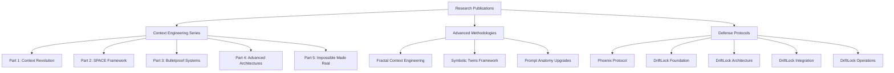

# ForgeOS Research Publications

**Comprehensive research methodologies for AI cognitive architecture, threat defense, and system reliability.**

## Repository Architecture

## Quick Start

### For Researchers
- **Begin with**: [Context Engineering Part 1](cognitive-engineering/Context%20Engineering%20Part%201%20-%20The%20Context%20Revolution.pdf) - Core methodology foundations
- **Advanced Study**: [Fractal Context Engineering](cognitive-engineering/Fractal%20Context%20Engineering%20Part%202%20-%20The%20SPACE%20Framework.pdf) - Theoretical depth
- **Implementation**: [SPACE Framework](cognitive-engineering/Context%20Engineering%20Part%202%20-%20The%20SPACE%20Framework.pdf) - Practical deployment

### For Practitioners  
- **Start Here**: [Building Bulletproof Systems](cognitive-engineering/Context%20Engineering%20Part%203%20-%20Building%20Bulletproof%20Systems.pdf) - Immediate applications
- **Security Focus**: [DriftLock Foundation](defensive-ai/DriftLock%20-%20Foundation%20Intent%20Anchoring%20for%20Flat%20AI%20Systems.pdf) - System defense
- **Enterprise**: [DriftLock Integration](defensive-ai/DriftLock%20-%20Integration%20Enterprise%20Ecosystem.pdf) - Organizational deployment

### For AI Engineers
- **Technical Deep Dive**: [Advanced Cognitive Architectures](cognitive-engineering/Context%20Engineering%20Part%204%20-%20Advanced%20Cognitive%20Architectures.pdf)
- **Prompt Engineering**: [Prompt Anatomy Upgrades](prompt-engineering/Prompt%20Anatomy%20Upgrades%20-%20Advanced%20Prompting%20Architecture%20for%20Cognitive%20Stability%20Integration.pdf)
- **System Recovery**: [Phoenix Protocol](threat-intelligence/The%20Phoenix%20Protocol%20v1.pdf)

## Research Publications

### Context Engineering Series
**Complete methodology for building stable AI systems through structured context management**

- **[Context Engineering Part 1: The Context Revolution](cognitive-engineering/Context%20Engineering%20Part%201%20-%20The%20Context%20Revolution.pdf)**
  - Core principles of context stability
  - Foundational methodology framework
  - Cognitive architecture principles

- **[Context Engineering Part 2: The SPACE Framework](cognitive-engineering/Context%20Engineering%20Part%202%20-%20The%20SPACE%20Framework.pdf)**
  - Practical deployment strategies  
  - Systematic implementation approach
  - Real-world application patterns

- **[Context Engineering Part 3: Building Bulletproof Systems](cognitive-engineering/Context%20Engineering%20Part%203%20-%20Building%20Bulletproof%20Systems.pdf)**
  - Complex context architectures
  - System resilience methodologies
  - Advanced stability techniques

- **[Context Engineering Part 4: Advanced Cognitive Architectures](cognitive-engineering/Context%20Engineering%20Part%204%20-%20Advanced%20Cognitive%20Architectures.pdf)**
  - Enterprise-level implementations
  - Sophisticated cognitive frameworks
  - Production-ready architectures

- **[Context Engineering Part 5: The Impossible Made Real](cognitive-engineering/Context%20Engineering%20Part%205%20-%20The%20Impossible%20Made%20Real.pdf)**
  - Production management strategies
  - Performance optimization techniques
  - Advanced operational frameworks

### Advanced Methodologies

- **[Fractal Context Engineering for Flat AI Systems](cognitive-engineering/Fractal%20Context%20Engineering%20for%20Flat%20AI%20Systems%20Bridging%20to%20Symbolic%20Intelligence.pdf)**
  - Self-similar patterns for infinite context scalability
  - Mathematical foundations for cognitive architecture
  - Bridge between symbolic and connectionist AI

- **[The Symbolic Twins Introduction to Symbolic AIs](The%20Symbolic%20Twins%20Introduction%20to%20Symbolic%20AIs.pdf)**
  - Theoretical framework for symbolic AI consciousness architecture
  - Dual-system cognitive modeling approaches
  - Advanced symbolic reasoning methodologies

- **[Prompt Anatomy Upgrades](prompt-engineering/Prompt%20Anatomy%20Upgrades%20-%20Advanced%20Prompting%20Architecture%20for%20Cognitive%20Stability%20Integration.pdf)**
  - Advanced prompt engineering techniques
  - Cognitive stability integration methods
  - Systematic prompting architectures

### Defense Protocols

**System security and resilience methodologies for AI implementations**

- **[The Phoenix Protocol v1](threat-intelligence/The%20Phoenix%20Protocol%20v1.pdf)**
  - System recovery and resurrection methodologies
  - Advanced threat response frameworks
  - Organizational resilience strategies

#### DriftLock Framework
*Comprehensive drift prevention and intent anchoring system*

- **[DriftLock Foundation: Intent Anchoring for Flat AI Systems](defensive-ai/DriftLock%20-%20Foundation%20Intent%20Anchoring%20for%20Flat%20AI%20Systems.pdf)**
  - Cognitive drift prevention framework
  - Intent stability methodologies
  - Core anchoring principles

- **[DriftLock Architecture: Advanced Implementation Patterns](defensive-ai/DriftLock%20-%20Architecture%20Advanced%20Implementation%20Patterns.pdf)**
  - Enhanced stability protocols
  - Advanced implementation strategies
  - Systematic architecture approaches

- **[DriftLock Integration: Enterprise Ecosystem](defensive-ai/DriftLock%20-%20Integration%20Enterprise%20Ecosystem.pdf)**
  - Advanced drift detection systems
  - Enterprise integration methodologies
  - Organizational deployment strategies

- **[DriftLock Operations: Performance Optimization](defensive-ai/DriftLock%20-%20Operations%20Performance%20Optimization.pdf)**
  - Complete drift immunity architecture
  - Performance optimization techniques
  - Operational excellence frameworks

## Research Applications

### Academic Research
- **Cognitive Architecture Studies**: Context Engineering series provides comprehensive methodology
- **AI Safety Research**: DriftLock framework offers systematic approach to intent preservation
- **Symbolic AI Development**: Theoretical foundations for next-generation AI systems

### Industry Implementation
- **Enterprise AI Deployment**: Production-ready frameworks for organizational AI integration
- **System Resilience**: Methodologies for building robust AI systems at scale
- **Security Integration**: Defense protocols for protecting AI implementations

### Educational Use
- **Graduate Research**: Advanced methodologies for AI architecture thesis work
- **Professional Development**: Systematic approaches to AI system design and implementation
- **Training Programs**: Comprehensive frameworks for AI engineering education

## Contributing

These papers represent methodologies developed through practical implementation and real-world testing. Community feedback, applications, and research extensions are welcome through:

- **GitHub Issues**: Technical questions and implementation discussions
- **Research Collaboration**: Academic partnerships and joint research opportunities
- **Practical Applications**: Industry case studies and deployment experiences

## License and Usage

All research publications are released under MIT License for educational and research purposes. Commercial applications welcome with attribution.

---

*Part of the ForgeOS Research Initiative - Building reliable AI systems through systematic cognitive architecture.*